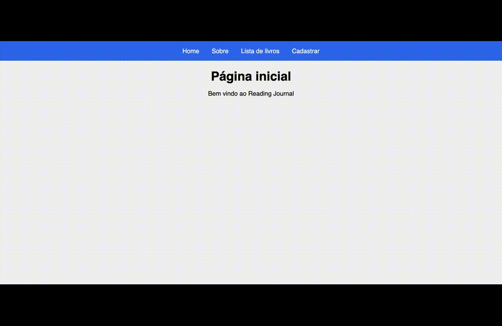

## Nome: `Marcos Fernando Vella Junior`

Para executar este projeto:

1. Entre pasta reading-journal no terminal:
```
cd exemplos/context-react-project
```

2. Rode npm install para instalar as dependências do projeto:


```
npm install
```

3. E em seguida, npm start, para iniciar a execução do projeto.

```
npm start
```

Após execução do projeto, este é o resultado esperado no navegador:


## Introdução

Este projeto contém uma estrutura básica a partir do template CRA, sem muitas alterações, com o objetivo de demostrar como compartilhar o estado de uma aplicação utilizando React Router e React Context API.

## Componentes

Os componentes estão no diretório `./src/components` e eles possuem as seguintes características:
- BookList:
  - Descrição: este componente renderiza uma lista de livros já cadastrados. Cada livro também pode ser removido ao clicar no botão `Remover`.
  - `props`
    - books: um array de livros para ser mostrado na lista
    - removeBook: um callback que deve ser chamado para remover determinado livro da lista. Esse callback deve atualizar o localStorage e o estado do componente pai.

- BookForm:
  - Descrição: este componente renderiza um form estilizado para coletar inputs do usuário afim de inserir o registro de um novo livro. Responsável por chamar a função `addBook` de `./src/utils/localStorage.js` para armazenar o livro em localStorage.

- Navbar:
  - Descrição: este componente utiliza Link do React Router para mostrar as páginas disponíveis em uma barra de navegação

## Conclusão

Este projeto é apenas para fins demonstrativos e não contém mais alterações do que as necessárias para demostrar algumas funcionalidades úteis para o desenvolvimento de projetos em ReactJS.